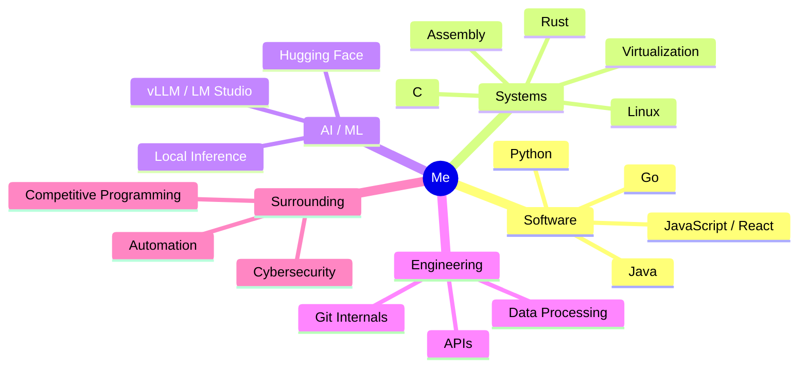
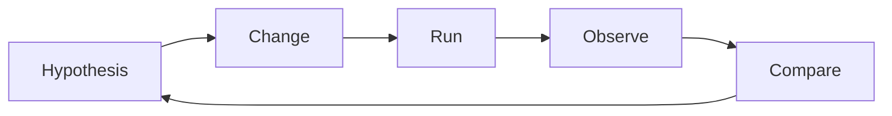

<div align="center">

# 👋 Hey, I'm a systems-curious, full-stack-to-bare-metal developer

### I like understanding how computers work *by making them do things*.


</div>

---

## 🧭 About Me

I'm a **self-taught, exploratory generalist developer**. I don't stick to one language, framework, or layer of the stack — I move between web development, systems programming, AI/ML, automation, and cybersecurity, usually because I want to know *what's happening underneath* the tool I'm using.

I'm not satisfied with:

> "I can use this."

I want to get to:

> "I understand why this works — and I can build my own version."

```text
Applications
    ↓
Web / Frontend / APIs
    ↓
Programming Languages
    ↓
Systems / OS / Linux
    ↓
Low-level Programming
    ↓
Hardware
```

---

## 🗺️ How My Interests Fit Together



---

## 🛠️ Languages & Tools

<div align="center">


</div>

I've gone from writing scripts to actually **shipping software** — I've published packages to PyPI:

| Package | Description |
|---|---|
| [`procworld`](https://pypi.org/project/procworld/) | Published Python package |
| [`pytimebudget`](https://pypi.org/project/pytimebudget/) | Published Python package |
| [`explipy`](https://pypi.org/project/explipy/) | Published Python package |

---

## 🚀 Featured Projects

### 🔍 Strata — Large-Scale Git Repository Analysis

A project exploring how deeply a system needs to analyze Git history to work across **arbitrary repositories**, and how that scales.

```text
Tested history depth:     500,000 commits
Authors observed:         208
Processing time:          ~2.5 minutes
CPU usage:                ~0.1%
RAM usage:                ~500 MB
```

The interesting question wasn't just *"does it work?"* — it was *"why does it behave this way at scale, and does that hold up?"*

### 🏫 RBRonline — Unified School Platform Concept

A web-platform concept combining features from several existing services (schedule management, tutoring, timetable/substitution tracking, and video content) into a single product experience — covering architecture, auth, UI, and multi-feature integration.

### 🤖 Minesweeper AI

A reinforcement-learning agent trained on Minesweeper, run for **~16 hours on a Raspberry Pi**, reaching roughly **30,000 episodes** — a long-running, hands-on ML experiment rather than a one-off tutorial.

### 🌐 API & Data Engineering Experiments

Built data pipelines against real-world APIs (including GDELT, NewsAPI, and Media Cloud), working through the practical realities production APIs throw at you:

```text
rate limiting · pagination · historical-date restrictions
partial results · network/socket errors · provider-specific quirks
```

### 🖥️ WhyIsMyPCSlow

A GUI-based diagnostic tool for Windows that checks CPU, RAM, disk usage, startup apps, background services, and more — then gives actionable suggestions to speed the system back up.

<div align="center">

 

</div>

---

## 📦 Check Out My Repos

<div align="center">

[](https://github.com/6wnt/pytimebudget)
[](https://github.com/6wnt/procworld)
[](https://github.com/6wnt/explipy)
[](https://github.com/6wnt/WhyIsMyPCSlow)

</div>

| Repo | What it does |
|---|---|
| [`pytimebudget`](https://github.com/6wnt/pytimebudget) | Zero-effort performance regression detection for Python |
| [`procworld`](https://github.com/6wnt/procworld) | Advanced procedural world generator library for Python |
| [`explipy`](https://github.com/6wnt/explipy) | Human-readable Python exception explanations |
| [`WhyIsMyPCSlow`](https://github.com/6wnt/WhyIsMyPCSlow) | GUI diagnostic tool for Windows PC performance |

*More repos are up on [my GitHub](https://github.com/6wnt) — this list highlights the ones with the most to show.*

---

## 🧠 Systems, AI & Infrastructure Exploration

<table>
<tr>
<td width="33%" valign="top">

**Operating Systems**
- Windows, Linux
- Arch, Fedora, Ubuntu, Garuda, Void
- Hyprland, KDE Plasma

</td>
<td width="33%" valign="top">

**Virtualization**
- VirtualBox
- VMware
- Hyper-V
- QEMU

</td>
<td width="33%" valign="top">

**AI / Local Inference**
- Hugging Face
- vLLM
- LM Studio
- Groq, Llama

</td>
</tr>
</table>

**Desktop rig:**

```text
CPU     AMD Ryzen 7 7800X3D
RAM     32 GB DDR5
GPU     NVIDIA RTX 5070 Ti
Storage 1 TB NVMe + 3 TB additional
Display 3440x1440 + 2560x1440
```

---

## 🏆 Competitive Programming

<div align="center">


</div>

- 📈 LeetCode global ranking climbed from **~9,000,000 → 4,688,821** in a short stretch of active practice
- 🥊 Registered for **Codeforces Spectral::Cup 2026** (stepped back from the duel format)

---

## 🧬 My Development Style



- **Exploratory** — I try things to find out what they can actually do
- **Systems-oriented** — I care about what's under the abstraction
- **Performance-conscious** — CPU, RAM, runtime, and scale matter to me
- **Self-directed** — most of what I know came from building, not a course
- **Curious about limits** — I like finding the edge cases, not just the happy path

---

<div align="center">

### 💬 "Can I remove the abstraction and see what's underneath?"

*That question is basically my whole personality as a developer.*

</div>
